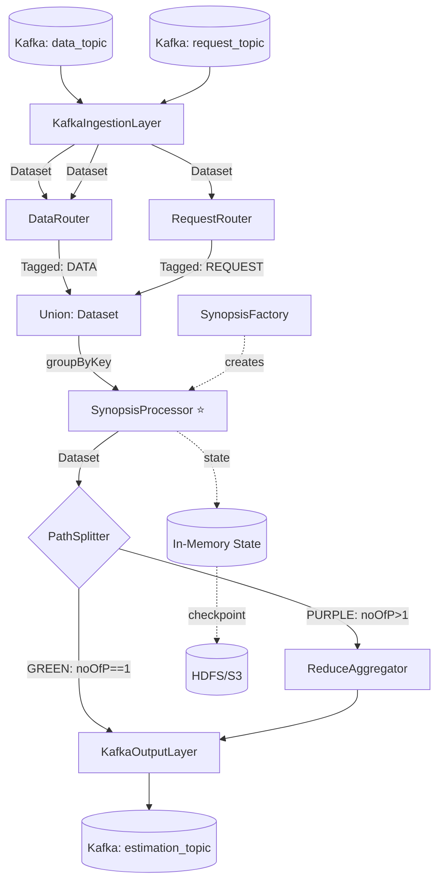

# SDE_Spark — Architecture Design

## Document Information

| Field | Value |
|-------|-------|
| **Project Name** | SDE_Spark — Synopsis Data Engine, Spark Edition |
| **Document Type** | Architecture Design |
| **Version** | 1.1 |
| **Date** | 2026-03-14 |
| **Status** | Draft |
| **Reference Project** | SDE (Apache Flink implementation) — read-only reference |

### Change Log

| Change | Date | Version | Description |
|--------|------|---------|-------------|
| Initial draft | 2025-02-09 | 1.0 | Complete architecture for Flink → Spark design |
| Standalone project clarification | 2026-03-14 | 1.1 | SDE_Spark is a new standalone project, not a module inside SDE |

---

## 1. Introduction

This document defines the architecture for **SDE_Spark** — a new, standalone implementation of the Synopsis Data Engine built on Apache Spark 3.5+ Structured Streaming. SDE_Spark is created from scratch as an independent project; it does not modify, extend, or depend on the existing SDE (Flink) codebase.

**Relationship to Existing SDE Project:**
The existing SDE project (Apache Flink 1.9.3) serves as a **read-only reference** for business logic, algorithmic behavior, and the Kafka wire format contract. No code is shared at the Maven/build level. POJOs, synopsis algorithms, and reduce functions are re-implemented from scratch in SDE_Spark, using the Flink codebase as the behavioral specification.

**Project Summary:**
- **Type:** New standalone project (not a migration of existing code)
- **Scope:** Implement core engine with 4 synopsis algorithms (CountMin, BloomFilter, HyperLogLog, AMS)
- **Approach:** Independent codebase preserving external Kafka API contract
- **Key Benefit:** Checkpointed state persistence (in-memory default, RocksDB optional), higher throughput, fault tolerance, security fixes

### 1.1 Reference Project Analysis (SDE / Flink)

#### Reference Project State

- **Primary Purpose:** Distributed stream processing platform for extreme-scale analytics using probabilistic data structures (synopses), providing Analytics-as-a-Service capabilities
- **Current Tech Stack:** Java 8, Apache Flink 1.9.3, Apache Kafka, Jackson JSON 2.9.5, Maven 3.x, with synopsis libraries (Clearspring stream-lib 3.0.0, Streaminer 1.1.1, Yahoo DataSketches 0.13.4)
- **Architecture Style:** Event-driven streaming pipeline with 6-layer architecture, Flink `RichCoFlatMapFunction`-based operators, hash-partitioned state management using in-memory `HashMap`
- **Deployment Method:** Fat JAR via Maven Shade Plugin, submitted to Flink cluster with CLI arguments for Kafka topics and parallelism

#### Reference Documentation

- `SDE/docs/architecture.md` (93KB) — Comprehensive Flink architecture documentation (behavioral reference)
- Research paper: *"And Synopses for All"* — Information Systems, Vol. 116, 2023
- `SDE/src/main/java/infore/SDE/` — Flink source code (algorithmic reference only)

#### Known Issues in Reference Project (Not to Repeat in SDE_Spark)

- **Flink 1.9.3 is EOL** — deprecated APIs (`SplitStream`, `OutputSelector`) — not relevant for SDE_Spark
- **State is heap-only** — `SDEcoFlatMap` loses all state on failure — SDE_Spark uses checkpointed state from day one (in-memory with HDFS/S3 snapshots)
- **No Serializable on Synopsis** — SDE_Spark implements `Serializable` on all Synopsis classes as a first-class requirement
- **Dynamic class loading** (case 25 in `SDEcoFlatMap`) — RCE vector — **not implemented in SDE_Spark**
- **Jackson 2.9.5 CVEs** — SDE_Spark starts with Jackson 2.15+
- **29 synopsis classes** with varying maturity — SDE_Spark v1.0 implements only the 4 production-quality algorithms (IDs 1, 2, 3, 4)

#### Key Architectural Patterns Observed

| Pattern | Implementation | Spark Implication |
|---------|---------------|-------------------|
| **CoFlatMap dual-input** | `SDEcoFlatMap` processes both data + requests on same keyed stream | Needs `flatMapGroupsWithState` with union-discriminator pattern |
| **Hash-based data routing** | `dataRouterCoFlatMap` expands data to all registered synopses | Must replicate in Spark state management |
| **Request expansion** | `RqRouterFlatMap` fans out 1 request to N partition copies | Spark broadcast or explicit fan-out |
| **Split stream routing** | `OutputSelector` splits to Green (single) vs Purple (multi) paths | Spark `filter()` + separate streams |
| **Two-stage reduce** | `ReduceFlatMap` → `GReduceFlatMap` (parallelism=1 bottleneck) | Spark `groupByKey` + aggregate (eliminates bottleneck) |
| **Synopsis factory** | Giant `switch` statement in `SDEcoFlatMap.flatMap2()` (cases 1-29) | Extract to proper factory pattern |

---

## 2. Enhancement Scope and Integration Strategy

### Enhancement Overview

- **Project Type:** New standalone implementation — not a modification of existing code
- **Scope:** Implement core engine with 4 synopsis algorithms (CountMin, BloomFilter, HyperLogLog, AMS), following the 6-layer pipeline architecture and 3-path merge design
- **Kafka Contract:** The external contract (topics, JSON message formats) is preserved identically to SDE/Flink, meaning upstream producers and downstream consumers are unaffected.

### Implementation Approach

**Code Strategy:**
SDE_Spark is written from scratch. The SDE Flink project is used only as a behavioral specification:

- **Message POJOs** (`Datapoint.java`, `Request.java`, `Estimation.java`) — re-implemented fresh with the same JSON wire format, Jackson 2.15+, and `Serializable`
- **Synopsis algorithms** (`CountMin`, `Bloomfilter`, `AMSsynopsis`, `HyperLogLogSynopsis`) — re-implemented with `Serializable` built in from the start; algorithmic logic referenced from Flink source
- **Routing/processing logic** — re-designed as Spark `flatMapGroupsWithState` operators; Flink operators serve as behavioral reference only
- **Nothing is copied** from the Flink codebase at the Maven/build level

**Database Integration:** N/A — No traditional database. State is managed in-memory (Spark's default HDFSBackedStateStore) with HDFS/S3 checkpointing. Can be upgraded to RocksDB if state exceeds memory limits.

**API Integration (Kafka):**

| Topic | Direction | Format | Change? |
|-------|-----------|--------|---------|
| `data_topic` | Input | JSON Datapoint | **No change** — same schema |
| `request_topic` | Input | JSON Request | **No change** — same schema |
| `estimation_topic` | Output | JSON Estimation | **No change** — same schema |
| `synopsis_union_topic` | Internal | JSON Estimation | **Deferred** (Yellow path not in v1.0) |

### Compatibility Requirements

- **Existing API Compatibility:** Kafka message formats (Datapoint, Request, Estimation JSON) MUST remain backward-compatible. Any producer sending requests to the Flink version should work unmodified against the Spark version. This enables **hot-swap migration**.
- **Performance Impact:** The PRD targets **100K-1M events/sec** (vs Flink's 10K-100K). Latency increases from ~10-100ms (Flink continuous) to ~1-5sec (Spark micro-batch) — an accepted trade-off documented in the PRD.

**Note:** SDE_Spark uses clean sequential IDs (1, 2, 3, 4). The SDE/Flink reference used non-sequential IDs (1, 2, 3, 7) due to its full 29-algorithm registry. Since SDE_Spark targets fresh clients with no existing integrations, sequential numbering is adopted.

---

## 3. Tech Stack

### Existing Technology Stack

| Category | Current Technology | Version | Usage in Enhancement | Notes |
|----------|-------------------|---------|---------------------|-------|
| **Language** | Java | 1.8 | **Upgrade to 11+** | Spark 3.5 requires Java 11 minimum |
| **Stream Framework** | Apache Flink | 1.9.3 | **Replace with Spark** | Core migration target |
| **Build Tool** | Maven | 3.x | **Keep** | No reason to change; update plugin versions |
| **Message Broker** | Apache Kafka | 2.0+ | **Keep** | Kafka remains the integration backbone |
| **JSON Serialization** | Jackson Databind | 2.9.5 | **Upgrade to 2.15+** | 2.9.x has known CVEs |
| **Probabilistic - Stream** | Clearspring stream-lib | 3.0.0 | **Keep** | Used by HyperLogLog, CountMin, Bloom |
| **Probabilistic - Streaminer** | Streaminer | 1.1.1 | **Keep for ported algos** | Used by HyperLogLog (alternative impl) |
| **Probabilistic - Yahoo** | DataSketches | 0.13.4 | **Upgrade to 5.x+** | Moved to `org.apache.datasketches` |
| **Date/Time** | Joda-Time | 2.10.1 | **Replace with java.time** | Java 11 has `java.time`; Joda-Time is legacy |
| **Geospatial** | GeographicLib-Java | 1.50 | **Defer** | Only used by Maritime synopses (not in v1.0) |
| **Logging** | SLF4J + Log4j 1.2 | 1.7.7 / 1.2.17 | **Upgrade** | Log4j 1.x is EOL; migrate to Log4j2 or Logback |
| **Testing** | JUnit | 4.12 | **Upgrade to 5.x** | JUnit 5 is standard for Java 11+ |
| **Build Plugin** | Maven Shade | 3.2.1 | **Keep** | Still needed for fat JAR packaging |

### New Technology Additions

| Technology | Version | Purpose | Rationale | Integration Method |
|------------|---------|---------|-----------|-------------------|
| **Apache Spark** | 3.5.x | Core stream processing framework | Migration target per PRD; Structured Streaming with micro-batch | Replaces Flink as primary dependency |
| **Spark Structured Streaming** | 3.5.x | Stream ingestion and processing API | Provides Kafka source/sink, state management, checkpointing | Maven dependency `spark-sql` |
| **In-Memory State Store** | (bundled, default) | State storage with checkpoint persistence | Fastest access, zero config; upgradable to RocksDB if state exceeds memory | Default — no configuration needed |
| **Spark Kafka Connector** | 3.5.x | Kafka integration | Replaces `flink-connector-kafka` | Maven dependency `spark-sql-kafka-0-10` |
| **Java 17 LTS** | 17 | Language runtime | Required by Spark 3.5; enables modern language features | Update `maven.compiler.source/target` |

---

## 4. Data Models and Schema Changes

### New Data Models

Since this is a framework migration (not a feature addition), the core data models are **ports of existing models** with modernization. No new domain entities are introduced.

#### Datapoint (Ported)

**Purpose:** Represents a single data event from a streaming source
**Integration:** Direct port from `infore.SDE.messages.Datapoint` — identical JSON contract

| Attribute | Type | Description |
|-----------|------|-------------|
| `dataSetKey` | `String` | Hash/partition key for routing |
| `streamID` | `String` | Source stream identifier |
| `values` | `JsonNode` | Flexible JSON payload |

**Changes from Flink version:**
- Field naming normalization with `@JsonProperty` for wire-format compatibility
- Remove `compare()` method (domain logic doesn't belong in message POJO)
- Must provide Spark `Encoder` via `Encoders.bean()` or `Encoders.kryo()`

#### Request (Ported)

**Purpose:** Synopsis management command (CREATE, DELETE, ESTIMATE, UPDATE)
**Integration:** Direct port from `infore.SDE.messages.Request` — identical JSON contract

| Attribute | Type | Description |
|-----------|------|-------------|
| `dataSetKey` | `String` | Routing key |
| `requestID` | `int` | Operation type (1=ADD, 2=DELETE, 3=ESTIMATE, etc.) |
| `synopsisID` | `int` | Algorithm type (1=CountMin, 2=Bloom, 3=AMS, 4=HLL) |
| `uid` | `int` | Unique synopsis instance identifier |
| `streamID` | `String` | Target stream |
| `param` | `String[]` | Algorithm-specific parameters |
| `noOfP` | `int` | Parallelism level |

**Changes:** Field naming normalization, input validation for v1.0 supported synopsisIDs, Spark Encoder support.

#### Estimation (Ported)

**Purpose:** Synopsis query result or continuous estimation output
**Integration:** Direct port from `infore.SDE.messages.Estimation` — identical JSON contract

| Attribute | Type | Description |
|-----------|------|-------------|
| `key` | `String` | Routing/partition key |
| `estimationKey` | `String` | Unique result identifier |
| `streamID` | `String` | Source stream |
| `uid` | `int` | Synopsis instance identifier |
| `requestID` | `int` | Original request type |
| `synopsisID` | `int` | Algorithm type |
| `estimation` | `Object` | Result value (polymorphic: Long, Double, Boolean, String) |
| `param` | `String[]` | Original parameters (echoed back) |
| `noOfP` | `int` | Parallelism level |

**Changes:** The `estimation` field typed as `Object` needs serialization strategy for state checkpointing (JSON string encoding or typed wrapper). Kryo serializer likely required.

#### Synopsis (Refactored Interface)

**Purpose:** Abstract base for all synopsis algorithm implementations
**Integration:** Refactored from `infore.SDE.synopses.Synopsis`

**Key Methods (unchanged contract):**
- `add(Object k)`: Ingest a data point
- `estimate(Object k)`: Point query
- `estimate(Request rq)`: Full estimation with metadata
- `merge(Synopsis sk)`: Combine two synopsis instances (for Purple path reduce)

**Critical Changes:**
- **Must implement `Serializable`** — required for state checkpointing (both in-memory and RocksDB backends)
- Extract creation logic into `SynopsisFactory`
- Add `byte[] serialize()` / `static Synopsis deserialize(byte[])` for state encoding

### Schema Integration Strategy

**State Storage Migration:**

| Aspect | Flink (Current) | Spark (New) |
|--------|----------------|-------------|
| **Storage** | `HashMap<String, ArrayList<Synopsis>>` in JVM heap | In-memory HashMap (default) — upgradable to RocksDB |
| **Key Format** | `String` (dataSetKey) | `byte[]` (serialized grouping key) |
| **Value Format** | Java object references | `byte[]` (serialized synopsis list) |
| **Durability** | None (lost on restart) | Checkpointed to HDFS/S3 |
| **Size Limit** | JVM heap (~GB) | Disk (~TB) |
| **Serialization** | Not needed (in-memory only) | **Required** — all Synopsis implementations must be serializable (for checkpointing) |

**Backward Compatibility:**
- Kafka JSON wire format is **identical** — no producer/consumer changes needed
- Consumer group IDs will differ (Flink vs Spark), enabling parallel operation
- State is **not migrated** — Spark starts with empty state (synopses must be re-registered)

---

## 5. Component Architecture

### Component Overview

The Spark implementation maps to the existing 6-layer architecture with cleaner separation of concerns:

#### KafkaIngestionLayer (Layer 1)

**Responsibility:** Consume raw JSON from Kafka, deserialize into typed POJOs
**Replaces:** `kafkaStringConsumer` + inline `MapFunction` in `Run.java`
**Technology:** Spark Kafka connector (`readStream.format("kafka")`)

#### RequestRouter (Layer 2)

**Responsibility:** Expand single request into N partition-specific copies, manage registration state
**Replaces:** `RqRouterFlatMap.java`
**Technology:** `flatMapGroupsWithState` with `GroupState<RequestRouterState>`

#### DataRouter (Layer 2)

**Responsibility:** Route data points to all registered synopsis instances
**Replaces:** `dataRouterCoFlatMap.java`
**Technology:** `flatMapGroupsWithState` with `GroupState<DataRoutingState>`

**Design Challenge:** Flink's `connect()` merges two streams natively. Spark lacks this. Solution: **Union with discriminator** — tag both streams as `InputEvent` (DATA | REQUEST), union them, dispatch in handler.

#### SynopsisProcessor (Layer 3 — THE HEART)

**Responsibility:** Core synopsis lifecycle — create, update (add data), estimate (query), delete
**Replaces:** `SDEcoFlatMap.java` (334 lines)
**Technology:** `flatMapGroupsWithState` with `GroupState<SynopsisProcessorState>`, in-memory state (default, upgradable to RocksDB)

**Translation from Flink:**

| Flink | Spark |
|-------|-------|
| `SDEcoFlatMap extends RichCoFlatMapFunction` | `flatMapGroupsWithState` function |
| `HashMap<String, ArrayList<Synopsis>> M_Synopses` | `GroupState<SynopsisProcessorState>` |
| `flatMap1(Datapoint)` — add to synopses | Discriminated handler: if DATA → iterate, call `add()` |
| `flatMap2(Request)` — create/delete/estimate | Discriminated handler: if REQUEST → switch on `requestID` |
| `collector.collect(estimation)` | Return `Iterator<Estimation>` |

#### SynopsisFactory (Layer 3 — Helper)

**Responsibility:** Create synopsis instances from request parameters
**Replaces:** Giant `switch` statement in `SDEcoFlatMap.flatMap2()` (cases 1-29)

```java
public class SynopsisFactory {
    public static Synopsis create(int synopsisID, int uid, String[] params)
        throws UnsupportedSynopsisException {
        return switch (synopsisID) {
            case 1  -> new CountMin(uid, params);
            case 2  -> new Bloomfilter(uid, params);
            case 3  -> new AMSsynopsis(uid, params);
            case 4  -> new HyperLogLogSynopsis(uid, params);
            default -> throw new UnsupportedSynopsisException(synopsisID);
        };
    }
}
```

#### PathSplitter (Layer 4)

**Responsibility:** Route estimations to correct aggregation path based on `noOfP`
**Replaces:** `SplitStream` / `OutputSelector` in `Run.java`
**Technology:** Simple `Dataset.filter()` — no state needed

#### ReduceAggregator (Layer 5)

**Responsibility:** Merge partial results from multiple partitions into single final result
**Replaces:** Both `ReduceFlatMap.java` AND `GReduceFlatMap.java`
**Technology:** `flatMapGroupsWithState` grouped by `uid`

**Critical improvement:** Eliminates `GReduceFlatMap.setParallelism(1)` bottleneck. Spark groups by `uid` naturally across partitions.

**Reduce functions per algorithm (v1.0):**

| Synopsis | synopsisID | Reduce Strategy | Function |
|----------|-----------|-----------------|----------|
| CountMin | 1 | Sum frequency counts | `SimpleSumFunction` |
| BloomFilter | 2 | Bitwise OR | `SimpleORFunction` |
| AMS | 3 | Sum sketches | `SimpleSumFunction` |
| HyperLogLog | 4 | Union/merge | `SimpleSumFunction` |

#### KafkaOutputLayer (Layer 6)

**Responsibility:** Serialize Estimation results to JSON, write to Kafka
**Replaces:** `kafkaProducerEstimation` + `addSink()` in `Run.java`
**Technology:** Spark Kafka sink (`writeStream.format("kafka")`)

### Component Interaction Diagram



See `docs/spark-architecture-diagram.png` for the full color-coded diagram with all details.

---

## 6. API Design and Integration

### API Integration Strategy

The SDE's API is **Kafka-based** — JSON message contracts on Kafka topics. The Spark version is a **drop-in replacement**: same input topics, same output topics, same JSON schemas.

- **Authentication:** None currently. Future: SASL/SSL for Kafka (out of v1.0 scope)
- **Versioning:** No mechanism exists. Message schemas are implicitly v1.

### Data Ingestion API

**Topic:** `data_topic` (configurable)

```json
{
  "dataSetkey": "EUR/USD",
  "streamID": "Forex",
  "values": {
    "time": "02/19/2019 06:07:14",
    "StockID": "ForexALLNoExpiry",
    "price": "110.11"
  }
}
```

**Note:** Field `dataSetkey` uses inconsistent casing (lowercase `k`). Preserved via `@JsonProperty("dataSetkey")`.

### Synopsis Management API

**Topic:** `request_topic` (configurable)

**Supported requestIDs in v1.0:**

| requestID | Operation | Supported |
|-----------|-----------|-----------|
| 1 | ADD_KEYED | Yes |
| 2 | DELETE | Yes |
| 3 | ESTIMATE | Yes |
| 4 | ADD_RANDOM | Yes |
| 5 | ADD_CONTINUOUS | Deferred |
| 6 | ESTIMATE_ADVANCED | Deferred |
| 7 | UPDATE | Deferred |

**Supported synopsisIDs in v1.0:**

| synopsisID | Algorithm | Parameters (param array) |
|-----------|-----------|-------------------------|
| 1 | CountMin | `[keyField, valueField, operationMode, epsilon, confidence, depth]` |
| 2 | BloomFilter | `[keyField, valueField, expectedInsertions, falsePositiveRate]` |
| 3 | AMS | `[keyField, valueField, buckets, depth]` |
| 4 | HyperLogLog | `[keyField, valueField, operationMode, relativeStdDev]` |

**ADD Request Example:**
```json
{
  "dataSetkey": "Forex",
  "requestID": 1,
  "synopsisID": 1,
  "uid": 1001,
  "streamID": "INTEL",
  "param": ["StockID", "price", "Queryable", "0.01", "4"],
  "noOfP": 4
}
```

**Unsupported synopsisIDs** return error Estimation (new behavior — Flink silently dropped these):
```json
{
  "key": "Forex_1001",
  "estimationkey": "Forex_1001",
  "uid": 1001,
  "requestID": 1,
  "synopsisID": 99,
  "estimation": "ERROR: Unsupported synopsisID 99. Supported: [1, 2, 3, 4]",
  "param": [],
  "noOfP": 1
}
```

### Estimation Output API

**Topic:** `estimation_topic` (configurable)

```json
{
  "key": "Forex_1001",
  "estimationkey": "Forex_1001",
  "streamID": "INTEL",
  "uid": 1001,
  "requestID": 3,
  "synopsisID": 1,
  "estimation": 42,
  "param": ["StockID", "price", "Queryable", "0.01", "4"],
  "noOfP": 4
}
```

**Estimation value types:**

| synopsisID | Algorithm | `estimation` type | Example |
|-----------|-----------|-------------------|---------|
| 1 | CountMin | `Long` (frequency) | `42` |
| 2 | BloomFilter | `Boolean` (membership) | `true` |
| 3 | AMS | `Double` (moment) | `1543.87` |
| 4 | HyperLogLog | `Long` (cardinality) | `1543287` |

---

## 7. Source Tree

### Existing Project Structure

```plaintext
SDE/                                        # Project root
├── pom.xml                                 # Maven build (Flink 1.9.3, Java 8)
├── README.md
├── docs/                                   # 22 documentation files
├── src/main/java/
│   ├── infore/SDE/
│   │   ├── Run.java                        # Main entry point
│   │   ├── messages/                       # 3 POJOs (Datapoint, Request, Estimation)
│   │   ├── synopses/                       # 29 synopsis implementations
│   │   ├── transformations/                # 10 Flink operators
│   │   ├── reduceFunctions/                # 15 merge strategies
│   │   ├── sources/                        # 7 Kafka connectors
│   │   ├── Experiments/                    # 13 test harnesses
│   │   └── producersForTesting/            # 8 Kafka test producers
│   └── lib/                                # Custom algorithm libraries
│       ├── Coresets/ TopK/ WDFT/ WLSH/ PastCOEF/ TimeSeries/
```

### SDE_Spark — Standalone Project Structure

```plaintext
SDE_Spark/                                      # Standalone project root
├── pom.xml                                     # Maven build (Spark 3.5, Java 17)
├── README.md
├── docs/                                       # Architecture docs
│   └── spark/                                  # Copied from SDE/docs/spark/
└── src/
    ├── main/java/infore/sde/spark/
    │   ├── SDESparkApp.java                    # Main entry point
    │   ├── config/
    │   │   └── SDEConfig.java                  # Kafka topics, trigger interval, checkpoint path
    │   ├── messages/                           # POJOs (re-implemented, same JSON contract as SDE)
    │   │   ├── Datapoint.java                  # implements Serializable
    │   │   ├── Request.java                    # implements Serializable
    │   │   └── Estimation.java                 # implements Serializable
    │   ├── synopses/                           # Synopsis algorithms (re-implemented with Serializable)
    │   │   ├── Synopsis.java                   # Abstract base — implements Serializable
    │   │   ├── CountMin.java                   # synopsisID = 1
    │   │   ├── Bloomfilter.java                # synopsisID = 2
    │   │   ├── AMSsynopsis.java                # synopsisID = 3
    │   │   ├── HyperLogLogSynopsis.java        # synopsisID = 4
    │   │   └── SynopsisFactory.java            # Factory: ID → implementation
    │   ├── reduceFunctions/                    # Merge strategies (re-implemented)
    │   │   ├── SimpleSumFunction.java          # CountMin, AMS, HLL
    │   │   └── SimpleORFunction.java           # BloomFilter
    │   ├── ingestion/                          # Layer 1
    │   │   └── KafkaIngestionLayer.java
    │   ├── routing/                            # Layer 2
    │   │   ├── RequestRouter.java
    │   │   ├── DataRouter.java
    │   │   └── RoutingState.java
    │   ├── processing/                         # Layer 3
    │   │   ├── SynopsisProcessor.java
    │   │   ├── SynopsisProcessorState.java
    │   │   └── InputEvent.java
    │   ├── aggregation/                        # Layers 4–5
    │   │   ├── PathSplitter.java
    │   │   └── ReduceAggregator.java
    │   └── output/                             # Layer 6
    │       └── KafkaOutputLayer.java
    └── test/java/infore/sde/spark/
        ├── integration/
        ├── processing/
        ├── aggregation/
        └── serialization/
```

### Project Guidelines

- **SDE_Spark is fully self-contained** — no Maven dependency on the SDE/Flink project
- **File Naming:** UpperCamelCase classes, lowerCamelCase methods/fields, layer-aligned package names
- **Serializable from day one:** Every Synopsis subclass and all state objects must implement `Serializable` — this is a project invariant, not an afterthought
- **JSON wire format:** `@JsonProperty` annotations must match SDE's field names exactly (including `dataSetkey` lowercase-k inconsistency) to preserve Kafka contract compatibility

---

## 8. Infrastructure and Deployment Integration

### Target Infrastructure

- **Deployment:** Fat JAR (Maven Shade Plugin) submitted to Spark cluster via `spark-submit`
- **Infrastructure Tools:** Apache Spark 3.5+ cluster, Apache Kafka brokers, Maven 3.x
- **Environments:** Development (local mode), Research cluster (TUC Softnet / YARN)

### Deployment Strategy

**Spark Submit Configuration:**
```bash
spark-submit \
  --class infore.sde.spark.SDESparkApp \
  --master spark://master:7077 \
  --deploy-mode cluster \
  --driver-memory 2g \
  --executor-memory 4g \
  --executor-cores 2 \
  --num-executors 4 \
  --conf spark.sql.streaming.checkpointLocation=hdfs:///sde/checkpoints \
  # Optional: uncomment to use RocksDB instead of in-memory state (for large state)
  # --conf spark.sql.streaming.stateStore.providerClass=org.apache.spark.sql.execution.streaming.state.RocksDBStateStoreProvider \
  --conf spark.serializer=org.apache.spark.serializer.KryoSerializer \
  sde-spark-1.0.0-SNAPSHOT.jar \
  --data-topic data_topic \
  --request-topic request_topic \
  --output-topic estimation_topic \
  --kafka-brokers localhost:9092 \
  --trigger-interval "1 second"
```

**Infrastructure Requirements:**

| Component | Required | Details |
|-----------|----------|---------|
| Spark cluster | Yes | Spark 3.5+ standalone, YARN, or Kubernetes |
| HDFS/S3 storage | Yes | State checkpoint persistence |
| Kafka | Yes | Same brokers and topics as SDE/Flink (or dedicated) |
| Local SSD on executors | Optional | Only needed if upgrading to RocksDB state backend |

### Validation Strategy

Since SDE_Spark is a new project, validation is done by running it alongside the existing SDE/Flink deployment (using a separate Kafka consumer group ID) and comparing outputs:

- Deploy SDE_Spark with consumer group `sde-spark-validation`
- SDE/Flink continues with consumer group `sde-flink-prod` (unaffected)
- SDE_Spark writes to `estimation_topic_spark` during validation
- Compare `estimation_topic` (Flink) vs `estimation_topic_spark` (Spark) for accuracy parity
- Once validated, point downstream consumers to SDE_Spark output

### Rollback Strategy

- SDE/Flink continues to run completely independently throughout — rollback is simply keeping consumers on Flink output
- No shared state between SDE and SDE_Spark — no state migration risk
- **Monitoring:** Spark UI (port 4040), Kafka consumer lag, state store metrics

---

## 9. Coding Standards

### Existing Standards Compliance

- **Code Style:** Inconsistent — mixed tabs/spaces, inconsistent field casing (`DataSetkey`, `RequestID`, `nOfP`), lowercase class names (`dataRouterCoFlatMap`, `kafkaStringConsumer`)
- **Linting:** None configured
- **Testing:** No automated tests; manual integration via `Experiments/` package
- **Documentation:** Minimal Javadoc; prevalent commented-out code

### Enhancement-Specific Standards

**Naming Convention (strict for new code):**

| Element | Convention | Example |
|---------|-----------|---------|
| Classes | UpperCamelCase | `SynopsisProcessor` |
| Methods | lowerCamelCase | `getDataSetKey()` |
| Fields | lowerCamelCase | `synopsisId` |
| Constants | UPPER_SNAKE | `MAX_PARALLELISM` |
| Packages | lowercase | `infore.sde.spark.processing` |
| JSON wire fields | Preserve original | `@JsonProperty("DataSetkey")` |

**Additional Standards:**
- Java 17 language features (`switch` expressions, `var`, `java.time`, text blocks)
- SLF4J logging exclusively (no `System.out.println`)
- No commented-out code (use git history)
- All Synopsis subclasses must implement `Serializable` with round-trip tests

### Critical Integration Rules

- **API Compatibility:** `@JsonProperty` annotations MUST exactly match existing wire format field names including inconsistent casing
- **Error Handling:** Defensive approach — catch and skip bad records (vs. Flink's restart-on-failure)
- **Logging:** SLF4J with Logback; ERROR for unrecoverable failures, WARN for recoverable issues, INFO for lifecycle events, DEBUG for per-record details
- **No retroactive cleanup** of Flink code in `sde-flink`

---

## 10. Testing Strategy

### Integration with Existing Tests

- **Existing Test Framework:** JUnit 4.12 declared but **no automated tests exist**
- **Test Organization:** None — testing via manual `Experiments/` and `producersForTesting/`
- **Coverage:** 0% automated

### Unit Tests (New)

**Framework:** JUnit 5 + Mockito
**Coverage Targets:** 80%+ for `sde-common`, 70%+ for `sde-spark`

**Critical test areas:**

| Component | Test Focus |
|-----------|-----------|
| Message POJOs | JSON round-trip, `@JsonProperty` wire format preservation |
| SynopsisFactory | Correct type creation, exception for unsupported IDs |
| CountMin | `add()` → `estimate()` accuracy within epsilon |
| Bloomfilter | Membership test, false positive rate bounds, OR merge |
| AMSsynopsis | Frequency moment estimation, merge correctness |
| HyperLogLog | Cardinality within relative std dev, union merge |
| SynopsisSerializer | Round-trip serialization for all 4 types with populated state |
| SynopsisProcessor | State transitions, error handling |
| ReduceAggregator | Collect N partials, correct merge, emit result |

### Integration Tests

**Approach:** Embedded Kafka (Testcontainers) + Spark local mode

| Scenario | Description |
|----------|------------|
| E2E-01 | Single CountMin, GREEN path, full Layer 1-6 |
| E2E-02 | Parallel Bloom (noOfP=4), PURPLE path, OR merge |
| E2E-03 | Multiple synopses on same stream |
| E2E-04 | Delete lifecycle |
| E2E-05 | HLL accuracy at 1M unique values |
| E2E-06 | Checkpoint recovery (kill → restart → state preserved) |
| E2E-07 | Malformed input handling |
| E2E-08 | Unknown synopsisID error response |

### Regression Testing

**Flink-Spark comparison** during migration Phase 2:

| Algorithm | Acceptable Divergence |
|-----------|----------------------|
| CountMin | Exact match (deterministic) |
| BloomFilter | Exact match (deterministic) |
| HyperLogLog | Within ±2% |
| AMS | Within ±5% |

---

## 11. Security Integration

### Existing Security Measures

- **Authentication:** None — plaintext Kafka connections
- **Authorization:** None — no access control
- **Data Protection:** None — plaintext JSON, no encryption
- **Security Tools:** None

### Enhancement Security Requirements (v1.0)

| Measure | Priority | Description |
|---------|----------|-------------|
| Jackson CVE remediation | **Critical** | Upgrade from 2.9.5 to 2.15+ |
| Remove dynamic class loading | **Critical** | Case 25 in SDEcoFlatMap is an RCE vector — do NOT port |
| Input validation | **High** | Validate JSON fields, reject malformed requests |
| Error response sanitization | **High** | No stack traces or system paths in error Estimations |
| Dependency audit | **High** | OWASP dependency-check plugin |
| Log sanitization | **Medium** | No user data at INFO level, prevent log injection |

### Deferred Security (v1.1+)

- Kafka SSL/TLS (encrypt in transit)
- Kafka SASL (authentication)
- Topic ACLs (authorization)
- Request signing (HMAC)
- Checkpoint encryption (HDFS/S3 at rest)

### Security Testing

- Input fuzzing (malformed JSON, extreme values, injection strings)
- Jackson deserialization safety (`FAIL_ON_UNKNOWN_PROPERTIES`, no polymorphic type handling)
- OWASP dependency scan in build (fail on CVSS >= 7.0)

---

## 12. Checklist Results

_Pending formal execution via `*execute-checklist`._

| Check | Status | Notes |
|-------|--------|-------|
| PRD alignment | Pending | Verify FR1-FR6 covered |
| Existing code analysis | Pass | All key files analyzed |
| Integration points | Pass | Kafka contract preserved |
| State management | Pass | In-memory state + HDFS/S3 checkpoint designed (RocksDB available as upgrade) |
| Scalability bottleneck | Pass | parallelism=1 eliminated |
| Security risks | Pass | RCE vector and CVEs flagged |
| Testing strategy | Pass | Unit + integration + regression |
| Deployment/rollback | Pass | Parallel operation + blue-green |

---

## 13. Next Steps

### Recommended Epic Sequence

| Order | Epic | Scope | Risk |
|-------|------|-------|------|
| 1 | **Project Setup** | New Maven project, `pom.xml` with Spark 3.5 deps, package structure, CI pipeline | Low |
| 2 | **Serialization Spike** | Implement all POJOs + Synopsis classes with `Serializable`, state round-trip tests | **High** |
| 3 | **Pipeline Skeleton (GREEN)** | Layers 1–6 with CountMin only, noOfP=1, end-to-end Kafka test | High |
| 4 | **PURPLE Path** | ReduceAggregator, multi-partition merge for CountMin | Medium |
| 5 | **Full Algorithm Suite** | Add BloomFilter, AMS, HyperLogLog to SynopsisFactory + all merge functions | Medium |
| 6 | **State Timeout (TTL)** | Activity-based TTL, eviction notifications, global 7-day safety net | Medium |
| 7 | **Error Handling & Validation** | Input validation, error responses, malformed data handling | Low |
| 8 | **Integration Testing** | E2E test suite, checkpoint recovery test | Medium |
| 9 | **Validation vs SDE/Flink** | Run in parallel with separate consumer group, compare outputs, performance benchmarks | High |

### Developer Handoff

- **SDE_Spark is a new project** — create a fresh Maven project, do not fork or modify the SDE/Flink repo
- **Key patterns:** Union-with-discriminator for dual-input, `flatMapGroupsWithState` for all stateful components, `Serializable` on all state objects, `@JsonProperty` for Kafka wire format compatibility
- **Algorithmic reference:** `SDE/src/main/java/infore/SDE/` — read-only behavioral reference for add(), estimate(), merge() logic
- **Build sequence:** project setup → POJOs + Synopsis classes with Serializable → serialization tests → Layer 1+6 (Kafka connectivity) → Layer 3 (processor) → Layer 2 (routing) → Layer 5 (reduce) → remaining algorithms → integration tests
- **Every PR must verify:** JSON deserialization round-trip compatibility with SDE wire format, Estimation output format match, algorithm accuracy within bounds, serialization round-trip correctness
